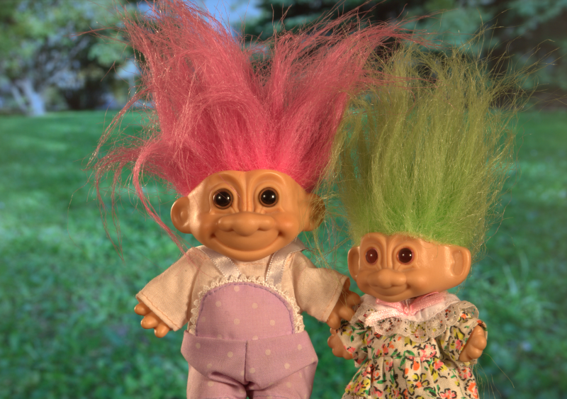
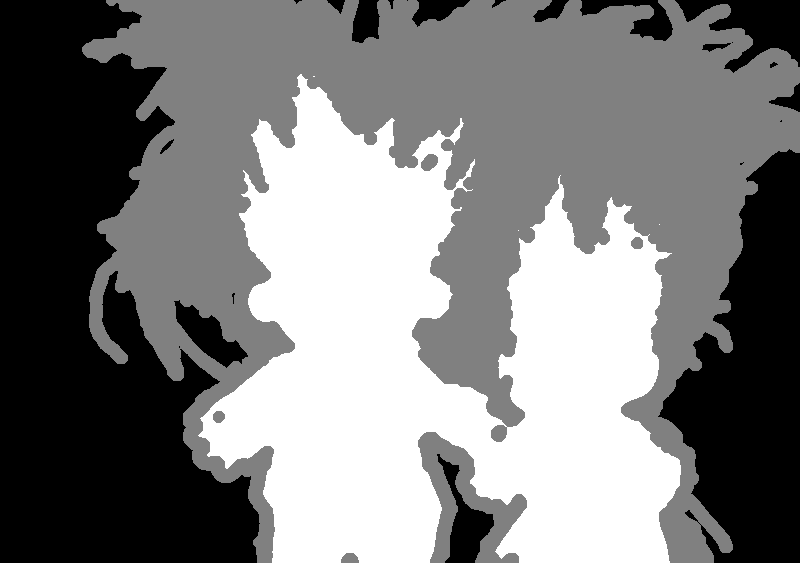
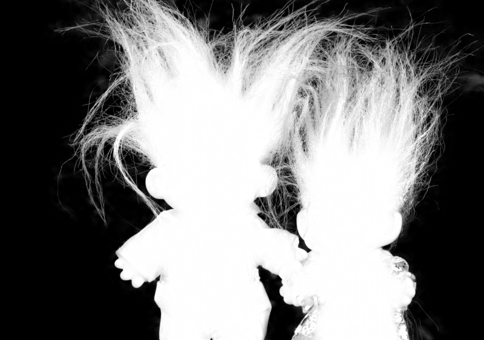

# Global Matting

Python implementation of He, Kaiming, et al. "A global sampling method for alpha matting." In CVPR 2011.

## Requirements

- numpy
- opencv-python
- scipy

## Usage

Run `matting.py`

## Result

| Input | Trimap | Alpha |
| :---: | :----: | :---: |
|  |  |  |